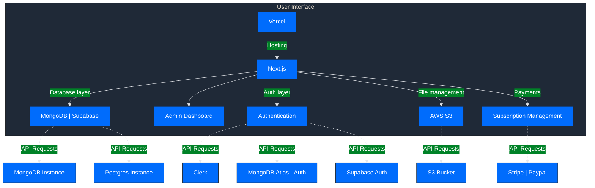

<!-- logo -->

  

<!-- title -->
<h1 align="center" style="display:flex;justify-content:center;align-items:center;width:100%;gap:10px;padding:10px 0;margin-bottom:20px;border-bottom:1px solid #4a4f57">
    My Center Manager
</h1>
<!-- powered by -->

  

<!-- brief description -->

  
  
    
  
  
My Manager Center is a SAAS app that allow users to manage their centers of service

<h2 style="display:flex;align-items:center;gap:10px;padding:10px 0;margin-bottom:20px;border-bottom:1px solid #4a4f57">
  
  Quick overview
</h2>

To be defined

  <a href="https://mycenter.mx">Website</a> •
  <a href="https://github.com/My-Center-Manager/legal/blob/main/LICENSE">License</a> •
  <a href="CONTRIBUTING.md">Contributing</a>

&nbsp;

<h2 style="display:flex;align-items:center;gap:10px;padding:10px 0;margin-bottom:20px;border-bottom:1px solid #4a4f57">
  
  High Level Architecture
</h2>

<h2 style="display:flex;align-items:center;gap:10px;padding:10px 0;margin-bottom:20px;border-bottom:1px solid #4a4f57">
  
  Features
</h2>

- 🌱 **Tips and Suggestions**: To be defined

- 📈 **Progress Tracking**: To be defined

- 🌍 **Community Interaction**: To be defined

- 📆 **Notifications/Reminders**: To be defined

<h2 style="display:flex;align-items:center;gap:10px;padding:10px 0;margin-bottom:20px;border-bottom:1px solid #4a4f57">
  
  Author
</h2>

**Alain Iglesias**

- Website: https://aiherrera.com
- Blog: https://blog.aiherrera.com
- Twitter: [@\_aiherrera](https://twitter.com/_aiherrera)
- Github: [@aiherrera](https://github.com/aiherrera)
- LinkedIn: [@-aiherrera](https://linkedin.com/in/-aiherrera)

<h2 style="display:flex;align-items:center;gap:10px;padding:10px 0;margin-bottom:20px;border-bottom:1px solid #4a4f57">
  
  Contribute
</h2>

Contributions, issues and feature requests are welcome! Feel free to check [issues page](https://github.com/My-Center-Manager/mycenter/issues). You can also take a look at the [contributing guide](https://github.com/My-Center-Manager/mycenter/blob/master/CONTRIBUTING.md)

<h2 style="display:flex;align-items:center;gap:10px;padding:10px 0;margin-bottom:20px;border-bottom:1px solid #4a4f57">
  
  Support the project
</h2>

If you consider this project worthy give it a ⭐️ and, why not, invite me a coffee 👇🤘🫶

  

<h2 style="display:flex;justify-content:center;align-items:center;gap:10px;padding:10px 0;margin-bottom:20px;border-bottom:1px solid #4a4f57"></h2>

Copyright © 2023 Alain Iglesias | This project is MIT licensed

