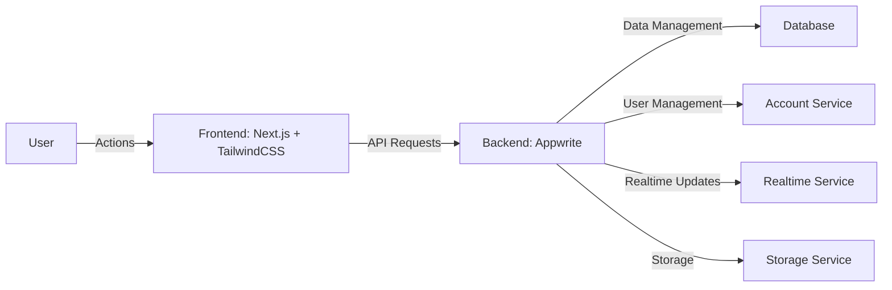

<!-- logo -->

  

<!-- title -->
<h1 align="center" style="display:flex;justify-content:center;align-items:center;width:100%;gap:10px;padding:10px 0;margin-bottom:20px;border-bottom:1px solid #4a4f57">
    EcoTracker
    
</h1>
<!-- powered by -->

  
  

<!-- brief description -->

  
  
    
  
  
EcoTracker is an app that offers tips and tracks progress towards living a more sustainable lifestyle.

<h2 style="display:flex;align-items:center;gap:10px;padding:10px 0;margin-bottom:20px;border-bottom:1px solid #4a4f57">
  
  Quick overview
</h2>

In an era where sustainability is more important than ever, EcoTracker seeks to provide an accessible and engaging platform for anyone looking to make a difference. Whether you're just starting on your sustainability journey or you're an eco-warrior, EcoTracker is designed to support and guide you. Give it a try and take your first (or next) step towards a more sustainable future.

  <a href="https://ecotracker.life">Website</a> •
  <a href="https://github.com/EcoTracker/legal/blob/main/LICENSE">License</a> •
  <a href="CONTRIBUTING.md">Contributing</a>

&nbsp;

<h2 style="display:flex;align-items:center;gap:10px;padding:10px 0;margin-bottom:20px;border-bottom:1px solid #4a4f57">
  
  High Level Architecture
</h2>

<h2 style="display:flex;align-items:center;gap:10px;padding:10px 0;margin-bottom:20px;border-bottom:1px solid #4a4f57">
  
  Features
</h2>

- 🌱 **Tips and Suggestions**: EcoTracker offers tips and suggestions on various categories of sustainability - like waste reduction, energy efficiency, and sustainable eating, providing a starting point for anyone looking to adopt a more eco-friendly lifestyle.

- 📈 **Progress Tracking**: With EcoTracker, users can set sustainability goals and track their progress over time. The platform offers a visual representation of progress, fostering motivation and adherence.

- 🌍 **Community Interaction**: EcoTracker isn't just a tool, but also a community. Users can share their own tips and experiences, fostering discussion and mutual growth towards a common goal of sustainability.

- 📆 **Notifications/Reminders**: To aid users in achieving their sustainability goals, EcoPath sends reminders and motivational messages. This helps users maintain consistency and progress towards a greener lifestyle.

<h2 style="display:flex;align-items:center;gap:10px;padding:10px 0;margin-bottom:20px;border-bottom:1px solid #4a4f57">
  
  Author
</h2>

**Alain Iglesias**

- Website: https://aiherrera.com
- Blog: https://blog.aiherrera.com
- Twitter: [@\_aiherrera](https://twitter.com/_aiherrera)
- Github: [@aiherrera](https://github.com/aiherrera)
- LinkedIn: [@-aiherrera](https://linkedin.com/in/-aiherrera)

<h2 style="display:flex;align-items:center;gap:10px;padding:10px 0;margin-bottom:20px;border-bottom:1px solid #4a4f57">
  
  Contribute
</h2>

Contributions, issues and feature requests are welcome! Feel free to check [issues page](https://github.com/aiherrera/ecotracker/issues). You can also take a look at the [contributing guide](https://github.com/aiherrera/ecotracker/blob/master/CONTRIBUTING.md)

<h2 style="display:flex;align-items:center;gap:10px;padding:10px 0;margin-bottom:20px;border-bottom:1px solid #4a4f57">
  
  Support the project
</h2>

If you consider this project worthy give it a ⭐️ and, why not, invite me a coffee 👇🤘🫶

  

<h2 style="display:flex;justify-content:center;align-items:center;gap:10px;padding:10px 0;margin-bottom:20px;border-bottom:1px solid #4a4f57"></h2>

Copyright © 2023 Alain Iglesias | This project is MIT licensed

